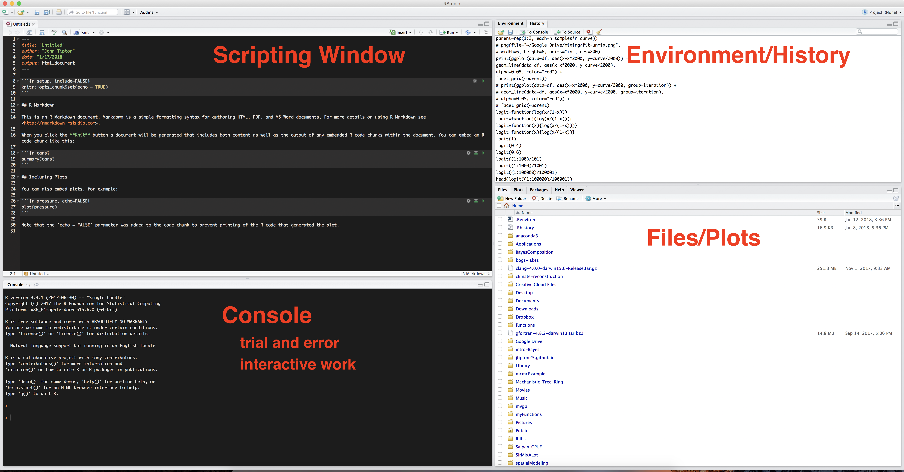
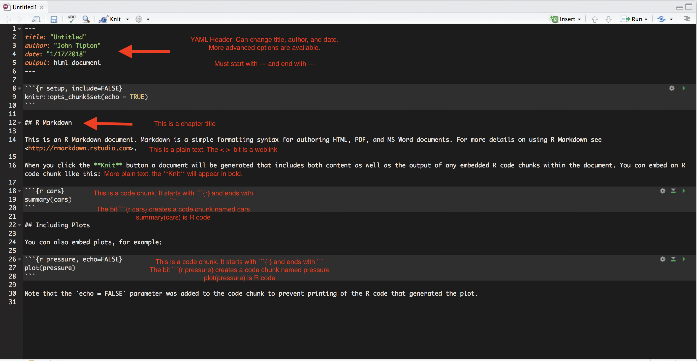
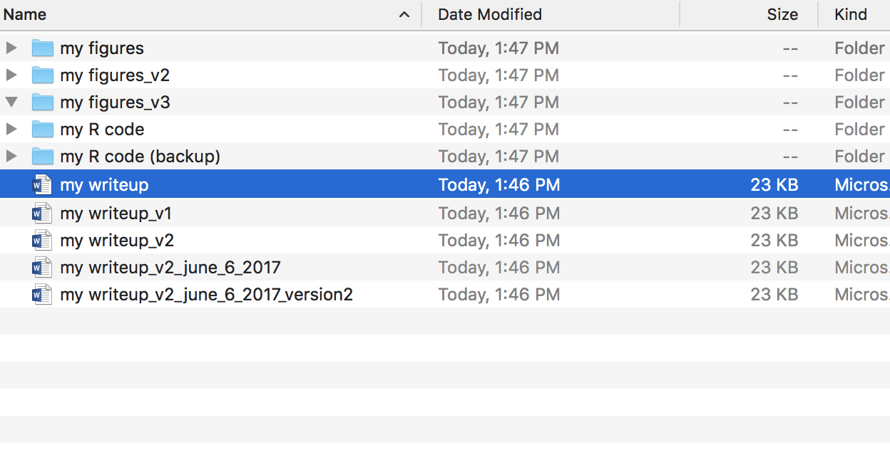

```{css, echo = FALSE}
.remark-slide-content {
  font-size: 18px;
  padding: 20px 80px 20px 80px;
}
.remark-code, .remark-inline-code {
  background: #f0f0f0;
}
.remark-code {
  font-size: 14px;
}
.huge .remark-code { /*Change made here*/
  font-size: 200% !important;
}
.very-large .remark-code { /*Change made here*/
  font-size: 150% !important;
}
.large .remark-code { /*Change made here*/
  font-size: 125% !important;
}
.small .remark-code { /*Change made here*/
  font-size: 75% !important;
}

.very-small .remark-code { /*Change made here*/
  font-size: 50% !important;
}
.tiny .remark-code { /*Change made here*/
  font-size: 40% !important;
}
```


```{r setup, include = FALSE, cache = FALSE, message = FALSE}
## set some knitr options
library(knitr)
library(here)
# ## Figure settings, defaults to png files
opts_chunk$set(fig.align='center', fig.width = 16/4,
               fig.height = 9/4, fig.show = 'hold', par = TRUE,
               dev='png',
               dpi=72*4, out.width = "80%")

colorize <- function(x, color) {
  if (knitr::is_latex_output()) {
    sprintf("\\textcolor{%s}{%s}", color, x)
  } else if (knitr::is_html_output()) {
    sprintf("<span style='color: %s'>%s</span>", color,
      x)
  } else x
}

hl <- function(x) {
  colorize(x, color = "corals2")
}
# 
# ## the "picture in picture" type of formatting
# knitr::opts_hooks$set(fig.callout = function(options) {
#   if (options$fig.callout) {
#     options$echo <- FALSE
#     options$out.height <- "99%"
#     options$fig.width <- 16
#     options$fig.height <- 8
#   }
#   options
# })
```

# Readings

* R for data science 
    * Introduction
    * Chapters 2 (Workflow: basics), 4 (Workflow: scripts), 6 (Workflow: projects), 21 (R Markdown), and 24 (R Markdown workflow)

---

# Introduction to RStudio

* For more examples and information, see [Programming with R](http://swcarpentry.github.io/r-novice-inflammation/) and [R for Reproducible Scientific Analyses](http://swcarpentry.github.io/r-novice-gapminder/).


Locate the different panels within RStudio: 


---

# Creating a new RMarkdown file

Let's start by creating a new RMarkdown file:

- In the menu bar click **File $\Rightarrow$ New File $\Rightarrow$ R Markdown**

--

- Choose the type of file, the output format, the title and the author and click OK.
    - In this class, we will almost always use a **pdf** format
    - **html** formats often look really slick

---

# Creating a new RMarkdown file

The RMarkdown file will be created with some default text. Let's run through it and see what it does.




---

# Working in RMarkdown

We can include plain text in RMarkdown by typing and can add `R` code by using the three tick marks and curly brace notation shown below. Any `R` code in the brackets will be run.
```{r, echo=FALSE, comment=""}
cat("```{r}\n\n```")
```

---

# Using R code in RMarkdown

For example, we can add two numbers, and the result will be printed below. 
```{r}
# add two numbers
4+9
```

Notice how the output is preceded by a #. The # represents a comment in R. Everything that is written on the same line as a comment after the comment is not executed. **Use comments everywhere! Your best collaborator/teammate is yourself from 6 months ago!**

.center[

]


---

# Comment your code!

```{r}
# demonstrate comments
5+7 # +8/9
```

- Note: I use two ## for comments (any number of ###s produces a comment until the end of the line)
---

# Variable assignment

We can assign variables to a value using the assign operator `<-`. Below we define the variable `value` as 5 and print the output.

```{r}
## assign values
value <- 5
print(value)
```

- Note: The equals symbol also works 

```{r}
## assign values
value = 5
print(value)
```

- There are **sometimes** cases where there is a difference but most times there is not a difference.

---

# Using R

We can perform calculations on the variable `value`. We multiply `value` by 5 and save the output in the variable `output`.

```{r}
## assign values that are a result of an operation
output <- value * 5
print(output)
```

and check that the output is the same as just multiplying by 5

```{r}
print(value*5)
```

---

# Try on your own:

- Create a new Rmarkdown document and give it the title "My first Rmarkdown Document"

- Write the line "To be or not to be, that is the question." in plain text in your RMarkdown. 

- After this line, create an `R` chunk and assign the variable `b` the value of 7. Then print the value of 2b.

- Add in a comment of your favorite Shakespeare quote (or any quote if you don't like Shakespeare).

- Compile the document and check that your answer looks like mine.

**Insert document created in class here**


---

# Updating/changing variables

We can also update the variable `value` in the code
```{r}
value <- 11
print(value)
value <- value - 8
print(value)
```

---

# Functions

We can also use functions. Almost all of the common mathematical functions are available. For example
```{r}
y <- log(10)
print(y)
z <- sin(4 * pi) / cos(sqrt(3 * pi))
print(z)
print(y+z)
```

---

# Functions

We can also use more complex functions and statistical functions. We will make more use of this throughout the course.

```{r, out.width='80%'}
hist(rnorm(100))
```

---

# Equalities/Inequalities

We can check if two values are equal using `==`
```{r}
7 == 6
(6/3) == 2
```

or, a safer way that avoids numerical overflow:

```{r}
2.0000000001 == 2
all.equal(2.0000000001, 2)
```

---

# Underflow

What is underflow? Underflow results from the computer using floating point arithmetic that only approximates the math. For example, $\pi$ has an infinitely long number of digits, but only has about 22 digits in `R`. 


```{r}
options(digits=22) 
pi
```

The `all.equal` command asks are these two values equal with respect to the rounding that a computer does.

* [Youtube: Subtracting through addition](https://www.youtube.com/watch?v=PS5p9caXS4U)

---

# Testing Inequalities

We can test if a variable is less than some value, greater than some value, or any other inequality.

```{r}
value <- 6
value < 4
value > 6
value >= 6
```

---

# Conditional Logic

We can use these tests to write conditional statements (if-else)

```{r}
value <- 6
if (value < 6) {
  print("less than 6")
} else if (value > 6) {
  print("greater than 6")
} else if (all.equal(value, 6)) {
  print("equals 6")
}
```

---

# Conditional Logic

```{r}
value <- 8
if (value < 6) {
  print("less than 6")
} else if (value > 6) {
  print("greater than 6")
} else if (all.equal(value, 6)) {
  print("equals 6")
}
```

---

# Tips and tricks

- Order of operations matters. Use parantheses to make things clear

```{r}
3 + 5 * 6
(3 + 5) * 6
3 + (5 * 6)
```

---

# Tips and tricks

- If you run a command that takes a long time or was wrong, you can cancel commands with `Esc` or `Ctrl+C`.

- The `ls()` command will list all of the variables and functions in the `R` environment.

- **Packages** use `install.packages("package name here")` to install packages


* If you get an error message "there is no package named tidyverse", you need to install and load the package.

    * You only need to install once per computer.
    
    * You need to load the library every time you work with the code.


```{r, eval = FALSE}
install.packages("tidyverse")  ## do this one time 
```

.small[
```{r, echo = FALSE}
library(tidyverse)
```
]

---

# In Class Problems

1. What will be the value of each variable after each statement below:

```{r}
mass <- 47.5
age <- 122
mass <- mass * 2.3
age <- age - 20
```

2. After running the code above, does `mass` equal `age`.

3. After running the code above, compare `mass` to `age`. Which is larger?

4. Install the following packages using `install.packages()`: `ggplot2` and `dplyr`


---

# Project-based analysis

* Use git.

* Have a consistent file structure and naming convention.

* Focus on reproduciblity and portability.

---

# RStudio Projects
Have you ever had a set of files that looked like this



---

.center[
  
]

---

# RStudio Projects

- It's hard to keep track of what the current version of the file is, what the current data are, what changes you made to the files, etc. It also makes it **really hard to go back to your work weeks, months, or even years later**.

- Instead, we can use **Projects** to organize our analyses. 

---

# Why use projects?
- It makes it easier to share your results
    - Example: you need to convince your boss that your results are meaningful

- Reproducing the analysis on new dataset is easier
    - Example: you are a financial trader and want to analyze 10 different stocks

- Resuming the project is easier after a break
   - You can switch back and forth between high-priority projects
   - You can take longer, more relaxing vacations 
   
---

# Creating a new RStudio Project

Let's create a new RMarkdown Project:

- In the menu bar click
**File $\Rightarrow$ New Project $\Rightarrow$ Existing Directory $\Rightarrow$ Current folder for class**

- Name your project
- Choose the project location -- add the project to your current gitLab folder
- Click create project


---


# Project organization
Often you want to organize your project into folders. A common set of folders includes

- put your script files in the `R` folder
- put your reports in the `docs` folder
- put your data files in the `data` folder
- put your processed data in the `results` folder

---

# Best practices

- Keep each project in its own folder (i.e. DASC1104)

- **NEVER EVER modify an Excel/data file by hand**
   - load the file into R, modify the data in R, then write an output 
file in the `results` folder
   - Never have to worry about "which dataset was this"
   - Data is time-consuming and costly to collect. 
   - Changing data in Excel leaves no record so you never know which data was the "original" or what changes were made
   - I write a script for processing data usually called `load-data.R` and use the `source` command to run the script.
   
   
---

# Best practices

- Treat any code **output** as disposable
   - With an `RMarkdown` document, `R` scripts, and `.py` scripts, you can always re-create the analysis

- Treat the **raw data** as sacred 

- If you write the same bit of code more than 3 times, figure out how to write a function
   - If you work on many projects, you might find yourself repeating tasks
   - One function reduces the chance of mistakes from typos or > copy/paste errors
  - Put functions in their own `.R` or `.py` files
  
  
---


# Best practices 

* Save your data in the `data` directory
* Learn to Google for help and read the help files using the `?` before a function.
    * `?lm` will get you the help page for the `lm` function for linear regression.
    * Google [linear regression in R](https://www.google.com/search?q=linear+regression+in+r&rlz=1C5CHFA_enUS753US753&oq=linear+regression+in+R&aqs=chrome.0.0l6.4927j0j7&sourceid=chrome&ie=UTF-8) for help on linear regression
    

---


# Working directories in R

- A `filepath` is the **address** of where a file is located.
   - On a Windows machine this might look like `C:\Documents\DASC1104` 
   - On a Mac it might look like `~/Documents/DASC1104`

- The **working directory** is the default filepath in R.
   - To find your working directory use the command `getwd()`.

```{r}
getwd()
```

---


# Working Directories and Projects

- If you use a project, the working directory starts in the project folder. 
   - On a Windows (Mac) machine with a project in the folder `:\Documents\DASC1104` (`~/Documents/DASC1104`), `getwd()` will return that file path.
   - If we follow the advice above about projects, we can get access to the `R` script at `C:\Documents\DASC1104\R\add-two-numbers.R` (`~/Documents/DASC1104/R/add-two-numbers.R`), by using the command `source(here("R", "add-two-numbers"))`.

- The `here` command from `library(here)` automatically constructs the filepath using the project then finds the file `add-two-numbers.R` in the `/R/` folder.


---


# Working Directories and Projects

Try this in your project now.

```{r}
library(here)
## source tells R to load/run the file 
source(here::here("R", "add-two-numbers.R"))

add_two_numbers(5, 7)
```

---


# Object types in `R` 

## data types


* character (string)
```{r}
name <- "Cora"
```

* numeric (like double/float in strongly typed languages)
```{r}
age <- 2
```

* integer
```{r}
fingers <- 10L
```

* complex
```{r}
spectrum <- 2 + 5i
```

* logical
```{r}
success <- TRUE
```

---

# Object types in `R` 

## data structures

* scalars
```{r}
a <- 4
```

* vectors
```{r}
x <- c(2, 3, 4.5)
```

* matrices
```{r}
y <- matrix(rnorm(6), nrow = 3, ncol = 2)
```

* arrays
```{r}
z <- array(rnorm(60), dim = c(4, 3, 5))
```

---

# Object types in `R` 

## data structures

* lists

```{r}
nba_player <- list(
  name = "Lebron James",
  height = 81,
  weight = 250,
  nicknames = c("King James", "LBJ", "Bron-Bron")
)
```

* data.frames

```{r}
dat <- data.frame(x = 1:10, y = rnorm(10), z = rep(c("a", "b"), each = 5))
```

* tibbles

```{r, message = FALSE}
library(tidyverse)
dat_tibble <- tibble(dat)
```

---

# Object types in `R` 

## data structures

* factors

```{r}
religion <- factor(c("catholicism", "judaism", "islam", "hinduism"))
quality <- factor(c("low", "medium", "high"), levels = c("low", "medium", "high"), ordered = TRUE)
```

---
    
# Object types in `R` 

## object attributes

* names

```{r}
names(nba_player)
```


```{r}
ores <- matrix(
  rnorm(20),
  nrow = 5, 
  ncol = 4,
  dimnames = list(
    location = paste("site", 1:5),
    variable = c("lead", "zinc", "copper", "tin")
  )
)
```


---
    
# Object types in `R` 

## object attributes

* dimension

.very-small[
```{r}
dim(ores)
```

```{r}
nrow(ores)
```

```{r}
ncol(ores)
```

```{r}
length(ores)
```

```{r}
length(nba_player)
```
]


---

# Object types in `R` 

## object attributes

.very-small[
* class

```{r}
class(ores)
```

```{r}
class(nba_player)
```

```{r}
class(dat_tibble)
```
      
* inheritance

    * e.g., animal class
    
    * a cat is an animal -> the cat class inherits the animal class
    
    * a lion is a cat and an animal -> the lion class inherits the cat and animal classes
]        

---


# Vector/Matrix operations

R is a very powerful for mathematical functions. One of the great benefits of `R` is the ability to easily apply functions to vectors, matrices, or even larger objects.

$$\begin{align*}
4 \begin{pmatrix} 1 \\ 2 \\ 3 \end{pmatrix}  & =
\begin{pmatrix} 4 \\ 8 \\ 12 \end{pmatrix}
\end{align*}$$

$$\begin{align*}
\begin{pmatrix} 1 \\ 2 \\ 3 \end{pmatrix} + 
\begin{pmatrix} 4 \\ 5 \\ 6 \end{pmatrix} & =
\begin{pmatrix} 5 \\ 7 \\ 9 \end{pmatrix}
\end{align*}$$


---

# Vectors

For instance, we can define a vector using the function `c()` and perform mathematical operations

```{r}
vec <- c(4, 5, 6)
vec / 2
vec2 <- c(10, 9, 6)
vec + vec2
vec / vec2
```


---

# Matrices

We can also create matrices

```{r}
A <- matrix(1:4, 2, 2)
A
B <- matrix(6:11, 2, 3)
B
```

---

# Matrices

And do math with matrices

$$\begin{align*}
\begin{pmatrix} 1 & 2 & 3 \\ 3 & 2 & 1 \\ 1 & 2 & 3 \end{pmatrix} + \begin{pmatrix} 4 & 5 & 6 \\ 7 & 8 & 9 \\ 10 & 11 & 12 \end{pmatrix}  & =
\begin{pmatrix} 5 & 7 & 9 \\ 10 & 10 & 10 \\ 11 & 13 & 15 \end{pmatrix}  
\end{align*}$$

```{r}
A <- matrix(c(1, 3, 1, 2, 2, 2, 3, 1, 3), 3, 3)
B <- matrix(c(4, 7, 10, 5, 8, 11, 6, 9, 12), 3, 3)

A + B
```

---

# Matrices

We can multiply matrices

$$\begin{align*}
\begin{pmatrix} 1 & 3 \\ 2 & 4 \end{pmatrix} \times \begin{pmatrix} 6 & 8 & 10 \\ 7 & 9 & 11 \end{pmatrix} & =
\begin{pmatrix} 27 & 35 & 43 \\ 40 & 52 & 64 \end{pmatrix}  
\end{align*}$$

```{r}
A <- matrix(1:4, 2, 2)
B <- matrix(6:11, 2, 3)
## matrix multiplication
A %*% B
```

---

# Matrices

Or select rows or columns of a matrix (order is rows first, column second)

- First row of

$$\begin{align*}
\begin{pmatrix} 1 & 3 \\ 2 & 4 \end{pmatrix}
\end{align*}$$

is 

$$\begin{align*}
\begin{pmatrix} 1 & 3 \end{pmatrix}
\end{align*}$$


```{r}
## select the first row of A
A[1, ]
```


---

# Matrices
- Third column of

$$\begin{align*}
\begin{pmatrix} 6 & 8 & 10 \\ 7 & 9 & 11 \end{pmatrix}
\end{align*}$$

is 

$$\begin{align*}
\begin{pmatrix} 10 \\ 11 \end{pmatrix}
\end{align*}$$

```{r}
## select the third column of B
B[, 3]
```


---

# For loops

- For loops are a powerful programming techniques. 

- For loops allow you to repeat the same procedure repeatedly over different values.

---

# For loops

- Let's try a simple example that prints the numbers from 1 to 6

```{r} 
## The a:b function creates a vector of integers starting 
## at a and ending at b
1:6

## loop over the variable i taking the values 1 to 6
for (i in 1:6) {  
  print(i)
}
```

---

# For loops

We could also print out a set of names one by one

```{r}
names <- c("John", "Paul", "Ringo", "George")

## loop over the variable i taking the values in names
for (i in names) {  
  print(i)
}
```

---

# For loops

- We can do mathematical procedures like calculate the cumulative sum of numbers from 1 to 100

```{r}
## define the variable out as a vector of 100 zeros

## rep(a, N) is a function that creates a vector
## of length N where each element is a
out <- rep(0, 100)
# print(out)
```

---

# For loops

```{r}
out[1] <- 1
## loop over the variable i taking the values 2 to 100
for (i in 2:100) {  
  ## take the value of the variable 
  ## out at the i-1 position, add i, 
  ## and save at the ith position of out
  out[i] <- out[i-1] + i    
}
# print(out)
## use the cumsum function
# cumsum(1:100)
all.equal(out, cumsum(1:100))
```

---

# Functions 
- Functions are an important tool. 

- Every time you need to do an operation multiple times, writing a function
   - increases your long term efficiency (your time is the most important)  
   - reduces the chance of errors (type the code once, less chance of typos).

---

# Functions

- We can create our version of the function `cumsum` by writing the function `my_cumsum` based on the for loop we wrote above.

```{r}
my_cumsum <- function(x) { ## x is the function argument
  ## N is the length of x
  N <- length(x)
  ## define a vector to store the output
  out <- rep(0, N)
  ## set the first element of out as the first element of x
  out[1] <- x[1]
  ## loop over the remaining N-1 values
  for (i in 2:N) {
    out[i] <- out[i-1] + x[i]
  }
  ## return the value out
  return(out)
}
```

---

# Functions

We can test our function using some examples
```{r}
a <- 5:13
my_cumsum(a)
all.equal(my_cumsum(a), cumsum(a))
```

---

# Functions

You can even call a function that calls a function that calls a function...

```{r}
my_cumsum(my_cumsum(my_cumsum(a)))
cumsum(cumsum(cumsum(a)))
```

```{r}
# knitr::include_graphics(here::here("images", "top.gif"))
```

