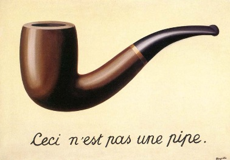
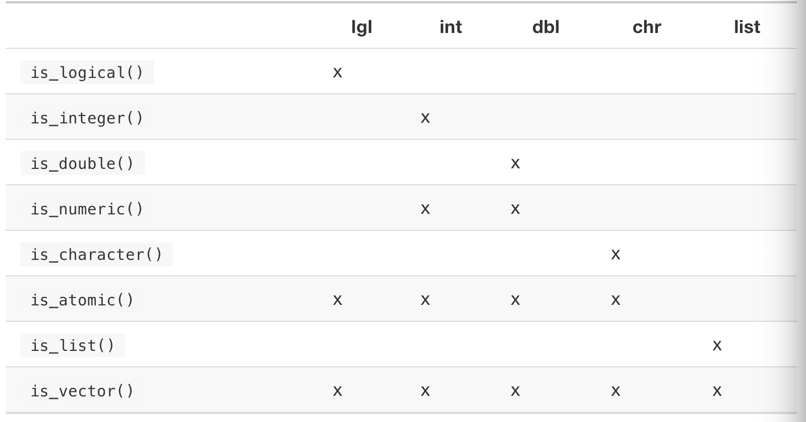

```{css, echo = FALSE}
.remark-slide-content {
  font-size: 18px;
  padding: 20px 80px 20px 80px;
}
.remark-code, .remark-inline-code {
  background: #f0f0f0;
}
.remark-code {
  font-size: 14px;
}
.huge .remark-code { /*Change made here*/
  font-size: 200% !important;
}
.very-large .remark-code { /*Change made here*/
  font-size: 150% !important;
}
.large .remark-code { /*Change made here*/
  font-size: 125% !important;
}
.small .remark-code { /*Change made here*/
  font-size: 75% !important;
}

.very-small .remark-code { /*Change made here*/
  font-size: 50% !important;
}
.tiny .remark-code { /*Change made here*/
  font-size: 40% !important;
}
```


```{r setup, include = FALSE, cache = FALSE, message = FALSE}
## set some knitr options
library(knitr)
library(here)
# ## Figure settings, defaults to png files
opts_chunk$set(fig.align='center', fig.width = 16/4,
               fig.height = 9/4, fig.show = 'hold', par = TRUE,
               dev='png',
               dpi=72*4, out.width = "80%")

colorize <- function(x, color) {
  if (knitr::is_latex_output()) {
    sprintf("\\textcolor{%s}{%s}", color, x)
  } else if (knitr::is_html_output()) {
    sprintf("<span style='color: %s'>%s</span>", color,
      x)
  } else x
}

hl <- function(x) {
  colorize(x, color = "corals2")
}
```

# Readings

* R for data science 
    * Introduction
    * Chapters 14 (Pipes with `magrittr`), 15 (Functions), 16 (Vectors), and 17 (Iteration with `purrr`)


---

# Pipes

```{r, message = FALSE}
library(tidyverse)
```

* Pipes `%>%` are from the `margittr` package (part of the `tidyverse`)

* Pipes focus on making functions act like verbs

```{r, echo = FALSE, out.width = "60%"}
# 
```

<!-- By Image taken from a University of Alabama site, "Approaches to Modernism": [1], Fair use, https://en.wikipedia.org/w/index.php?curid=555365 -->

---

# Pipes

> The itsy bitsy spider went up the water spout

> Down came the rain and washed the spider out

> Out came the sun and dried up all the rain

> And the itsy bitsy spider went up the spout again

* multiple variable names, likely to make a typo

```
itsy_bitsy_spider_1 <- went(itsy_bitsy_spider, up = "waterspout")
itsy_bitsy_spider_2 <- rain_down(itsy_bitsy_spider_1, washed = "out")
itsy_bitsy_spider_3 <- sun(itsy_bitsy_spider_2, dried = "rain")
itsy_bitsy_spider_4 <- went(itsy_bitsy_spider_3, up = "spout again")
```


* overwriting the data, likely to make errors

```
itsy_bitsy_spider <- went(itsy_bitsy_spider, up = "waterspout")
itsy_bitsy_spider <- rain_down(itsy_bitsy_spider, washed = "out")
itsy_bitsy_spider <- sun(itsy_bitsy_spider, dried = "rain")
itsy_bitsy_spider <- went(itsy_bitsy_spider, up = "spout again")
```

---

# Pipes

> The itsy bitsy spider went up the water spout

> Down came the rain and washed the spider out

> Out came the sun and dried up all the rain

> And the itsy bitsy spider went up the spout again

* hard to read

```
went(
    sun(
        rain_down(
            went(itsy_bitsy_spider, up = "waterspout"),
            washed = "out"),
        dried = "rain"),
    up = "spout again"
)
```

* Much better

```
itsy_bitsy_spider %>%
    went(up = "waterspout") %>%
    rain_down(washed = "out) %>%
    sun(dried = "rain") %>%
    went(up = "spout again")
```

---

# Pipes

* How does the pipe work?

```{r}
x <- 1:10
x %>%
  mean()
```

is equivalent to 

```{r}
x %>%
  mean(.)
```

where the `.` is a placeholder for the variable `x` which results in 

```{r}
mean(x)
```


---

# Pipes

* Pipes are not always the optimal choice

* Try to avoid super long chains of pipes

    * Instead: break up the pipe into intermediate objects

* Pipes can't handle multiple inputs/outputs

--

* How to build a chain of pipes
    
    * Start by outlining a plan of attack
    
    * Write one small subset of the pipe chain at a time and verify the results


* Challenge: Ask me questions about the `diamonds` data

---

# Functions

* Remember, writing code is for humans, not computers

* Make code readable and descriptive

* Reduce errors and typos

* Easily update/fix all examples

---

# Keep it DRY


* Don't Repeat Yourself

* If you copy and paste code 3 or more times, write a function

* Generate some data 

```{r}
df <- data.frame(
  x = rnorm(10), 
  y = rnorm(10),
  z = rnorm(10)
)
```

* The above isn't DRY, but there is no chance of errors and the code is easy to understand

---

# DRY

* Transform each variable to mean 0, standard deviation 1

```{r}
x_scaled <- (df$x - mean(df$x, na.rm = TRUE)) / sd(df$x, na.rm = TRUE)
y_scaled <- (df$y - mean(df$y, na.rm = TRUE)) / sd(df$y, na.rm = TRUE)
z_scaled <- (df$z - mean(df$z, na.rm = TRUE)) / sd(df$y, na.rm = TRUE)
```
    
--

* Can you spot the error?

--

```{r, eval = FALSE}
z_scaled <- (df$z - mean(df$z, na.rm = TRUE)) / sd(`df$y`, na.rm = TRUE)
```


* write a function to do this

```{r}
rescale_variable <- function(x) {
  mean_x <- mean(x, na.rm = TRUE)
  sd_x   <- sd(x, na.rm = TRUE) 
  ## save the variable for the output
  out <- (x - mean_x) / sd_x
  return(out)
}
```

* Much less likely to make an error

```{r}
x_scaled <- rescale_variable(df$x)
y_scaled <- rescale_variable(df$x)
z_scaled <- rescale_variable(df$z)
```


---

# Naming Functions

* Name functions for human readers!

```{r, eval = FALSE}
# bad name -- what does this do?
f()

# what does this do?
func()

# longer names -- use autocomplete
fill_missing_values()
pre_process_data()
```

* Don't name your functions over functions or variables which already exist!

```{r, eval = FALSE}
mean <- function(x) {}
TRUE <- function(x, y) {}
```

---

# Naming Functions

* Pick a naming convention and stick with it (I prefer snake case)

```{r}
# snake case
my_function_name <- function(x, y) {}
# camel case
myFunctionName <- function(x, y) {}
```

* Try to reuse leading names -- allows for autocomplete

```{r, eval = FALSE}
# better
check_input()
check_parameters()
check_inits()

# not as good
input_check()
parameters_check()
inits_check()
```

---

# Conditional statements

* `if()` and `if() {} else {}` statements


```{r, eval = FALSE}
if (condition) {
  # do something if condition is TRUE
} else {
  # do something if condition is FALSE
}
```

* Conditions must be either `TRUE` or `FALSE`

```{r, error = TRUE}
if (NA) {}
```


---

# Conditional statements

* Example: write a function to compare a number

.small[
```{r}
compare_number <- function(x, y) {
  ## compare the input number x to the number y
  if (x < y) {
    # default behavior is return
    str_c(x, "is less than", y, sep = " ")
  } else if (x > y) {
    # default behavior is return
    str_c(x, "is less greater", y, sep = " ")
  } else {
    # default behavior is return
    str_c(x, "and", y, "are equal", sep = " ")
  }
}
```
]

```{r}
compare_number(3, 4)
compare_number(5, 5)
```

---

# Logical comparisons

* Use `||` for or

```{r}
TRUE || FALSE
```

* Use `&&` for and

```{r}
TRUE && FALSE
```

* Note: `|` and `&` are vectorized, `||` and `&&` are not

.pull-left[
```{r}
c(TRUE, TRUE, FALSE) || c(TRUE, FALSE, FALSE)
c(TRUE, TRUE, FALSE) | c(TRUE, FALSE, FALSE)
```
]

.pull-right[
```{r}
c(TRUE, TRUE, FALSE) && c(TRUE, FALSE, FALSE)
c(TRUE, TRUE, FALSE) & c(TRUE, FALSE, FALSE)
```
]


---

# Logical comparisons

* `any()` and `all()`

```{r}
any(c(TRUE, FALSE, FALSE))
any(c(FALSE, FALSE, FALSE))
all(c(TRUE, FALSE))
all(c(TRUE, TRUE))
```


---

# Logical comparisons

* `identical()`, `all.equal()`, and `dplyr::near()`

* rounding (floating point math) can cause issues

.pull-left[
```{r}
identical(2L, 2)
all.equal(2L, 2)
near(2L, 2)
```
] 

.pull-right[
```{r}
identical(sqrt(2)^2, 2)
all.equal(sqrt(2)^2, 2)
near(sqrt(2)^2, 2)
sqrt(2)^2 - 2
```
]


---

# Multiple conditions

* `if () {} else if () {} else {}`

* `switch()`


```{r}
# evaluate based on position
switch(1, "red", "green", "blue")
switch(3, "red", "green", "blue")
```


---

# Multiple conditions

* switch

.pull-left[
```{r}
# evaluate based on match
switch("christmas", 
       "christmas" = c("red", "green"),
       "st. patricks day" = "green",
       "kwanzaa" = c("black", "red", "green"),
       "valentines" = "red",
       "easter" = "pastels", 
       stop("Unknown")
)

switch("st. patricks", 
       "christmas" = c("red", "green"),
       "st. patricks" = "green",
       "kwanzaa" = c("black", "red", "green"),
       "valentines" = "red",
       "easter" = "pastels", 
       stop("Unknown")
)
```
]


.pull-right[
```{r, error = TRUE}
# evaluate based on match
switch("kwanzaa", 
       "christmas" = c("red", "green"),
       "st. patricks day" = "green",
       "kwanzaa" = c("black", "red", "green"),
       "valentines" = "red",
       "easter" = "pastels", 
       stop("Unknown")
)

switch("fourth of july", 
       "christmas" = c("red", "green"),
       "st. patricks" = "green",
       "kwanzaa" = c("black", "red", "green"),
       "valentines" = "red",
       "easter" = "pastels", 
       stop("Unknown Holiday")
)
```
]

---

# code style

* See [Google's R coding style guide](https://google.github.io/styleguide/Rguide.html) and the [Tidyverse R coding style](https://style.tidyverse.org/)

* There is also a [Google python code style guide](https://google.github.io/styleguide/pyguide.html)

* Develop a consistent style and stick with it

* Coding style will make your code more readable

---

# Function arguments

* Typically, functions will have two components

    * the data (first arguments)
    
    * the options for the function (later arguments, often given default values)
    
* `mean()`

    * `x` is the data
    
    * `trim` is the number of smallest/largest values to drop
    
    * `na.rm` is what to do with missing values
    
```{r, eval = FALSE}
?mean
```

* Make the default arguments the most commonly used
    * Exception: force the user to omit missing values 

---

# Function arguments

* Calculate a 95% confidence interval for the mean

```{r}
ci_mean <- function(x, conf_level = 0.95, na.rm = FALSE) {
  ## calcuate CI for vector of data x
  n      <- length(x)
  if (na.rm == TRUE) {
    n    <- length(na.omit(x))
  }
  xbar   <- mean(x, na.rm = na.rm)
  s      <- sd(x, na.rm = na.rm)
  alpha  <- 1 - conf_level
  t_crit <- qt(c(alpha/2, 1 - alpha/2), n-1)
  return(xbar + t_crit * s / sqrt(n))
}
x <- rnorm(100, 5, 2)
```

.pull-left[
```{r}
ci_mean(x)
x[2] <- NA
ci_mean(x)
```
]

.pull-right[
```{r}
ci_mean(x, na.rm = TRUE)
ci_mean(x, conf_level = 0.8, na.rm = TRUE)
```
]

---

# Calling functions

* Call the arguments in order
    
```{r}
# good or bad?
mean(trim = 2, x = 1:10)
```

--
    
```{r, show = "hold"}
# better
mean(x = 1:10, trim = 2)
mean(1:10, trim = 2)
```


* Use the full name of any default arguments that you change

* Any non-standard calls should use the full name of the arguments

```{r, eval = FALSE}
# confusing argument -- use the full names
mean(1:10, tr = 2)
```
    
    
---

# Naming arguments

There are many times where a name is commonly used by convention

* `x`, `y`, `z`: vectors.
* `w`: a vector of weights.
* `df` or `dat`: a data frame.
* `i`, `j`: numeric indices (typically rows and columns).
* `n`: length, or number of rows.
* `p`: number of columns.


---

# Checking arguments

* `stop()` interrupts the function and returns an **error**
    * red light
    
* `warining()` allows the function to continue and returns a **warning**
    * yellow light
    
* `message()` allows for output to be printed 
    * street sign
    * some use alternatives like `cat()` and `print()`. **Don't use these** as they are harder to disable when not wanted
    * Rmarkdown code chunks have the option `message = FALSE` to suppress `messages()` but this doesn't work for `cat()` and `print()`
    
---

# Checking arguments

```{r}
add_matrices <- function(A, B) {
  # can only add matrices if they are the same size
  if (dim(A) != dim(B) || !is.matrix(A) || !is.matrix(B)) {
    stop("A and B must be matrices of the same dimension")
  }
  return(A + B)
}

A <- matrix(1:6, 3, 2) 
b <- 7:12
```

```{r, error = TRUE}
add_matrices(A, b)
```

```{r, error = TRUE}
B <- matrix(7:12, 2, 3)
add_matrices(A, B)
```

.small[
```{r}
B <- matrix(7:12, 3, 2)
add_matrices(A, B)
```
]

---

# Error checking

* The amount of error checking depends on the use
    1. Is this a function for personal use only?
    2. Is your function going to be used by others?
    3. Is your function going to be used in production?
    
* For 1), you don't need much checking. For 2) and 3), you need robust error checks 

* What might you want to check?
    * Data/variable dimensions and sizes
    * Variable types (numeric, character, logical)
    * Missing values
    * Correct arguments

.pull-left[
```{r, error = TRUE}
B <- matrix(NA, 3, 2)
add_matrices(A, B)
```
]

.pull-right[
```{r, error = TRUE}
B <- matrix("a", 3, 2)
add_matrices(A, B)
```
]


---

# Error checking

* Formal error checking is called "unit testing" in software engineering

* Unit testing involves writing automated tests for functions to verify their behavior and their respective error messages

* Break functions into small "units" that can be easily tested

* Test driven development

    * Write the tests for how your function will fail before you write the function
    
    * Make the function pass the test using error checking (`stop()`)
    
    * Then, write the actual function and verify the expected output for given input
    
---

# The `...` function argument

* `...` is a placeholder for other arguments!

--

```{r, results = "asis", echo = FALSE}
if (knitr::is_html_output()) { 
  # if (dir.exists("../../img"))
  #   if (file.exists("../../img/yada+yada+yada_3o85xyqTde87u0L8qc.gif")) 
  #     cat(".center[  ]")
  if (dir.exists("./img"))
    if (file.exists("./img/yada+yada+yada_3o85xyqTde87u0L8qc.gif")) 
      cat(".center[  ]")
} 
```

---

# The `...` function argument

* `...` is a placeholder for other arguments!

    * python uses `*args` and `*kwargs`

```{r}
#?sum
sum(1, 2, 3)
sum(6, 5, 4, 3, 2)
```

* Super flexible, but can be complicated

* `...` also makes functions prone to spelling errors

```{r}
sum(2, 3, 4, NA, na.mr = TRUE)
```
    

---

# Function returns

* Default behavior is to return the last line executed in the function

* I prefer to always explicitly use `return()` as it is easier to read

.pull-left[
```{r}
add_two_numbers <- function(a, b) {
  a + b
}
add_two_numbers(5, 7)
```
]

.pull-right[
```{r}
add_two_numbers <- function(a, b) {
  return(a + b)
}
add_two_numbers(5, 7)
```
]

---

# Function returns

* Return within a conditional

```{r}
mathify_two_numbers <- function(a, b, operator = "+") {
  if (operator == "+") {
    return(a + b)
  } else if (operator == "-") {
    return(a - b)
  } else if (operator == "*") {
    return(a * b)
  }
  stop('Operator must be either "+", "-", or "*"')
}
```

```{r, error = TRUE}
mathify_two_numbers(6, 8, operator = "+")
mathify_two_numbers(6, 8, operator = "/")
```


---

# Function returns

* Make the function better -- add error checking at the beginning

* More readable

```{r}
mathify_two_numbers <- function(a, b, operator = "+") {
  
  if (!(operator %in% c("+", "-", "*"))) {
    stop('Operator must be either "+", "-", or "*"')
  }
  
  if (operator == "+") {
    return(a + b)
  } else if (operator == "-") {
    return(a - b)
  } else if (operator == "*") {
    return(a * b)
  }
}
```

---

# Making functions pipeable

* Pipes are a chain of `data.frames`

* Use `invisible()` to return a `data.frame` without printing

```{r}
show_missing <- function(df) {
  n <- sum(is.na(df))
  # use message not cat/print
  message("Missing values: ", n)
  # return the df without printing
  invisible(df)
}
```

```{r}
msleep %>%
  select(brainwt) %>%
  show_missing() %>%
  mutate(brainwt_lbs = 2.2 * brainwt)
```

---

# Environments

* Global and local environments

```{r}
# y is assigned the value 4 in the global environment
y <- 4

print(y)

f <- function() {
  # y is assigned the value 6 in the local environment
  y <- 6
  print(y)
}

# in the local environment in the function f, y is 6
f()

# the variable y is still 4 in global environment
# the local environment doesn't overwrite the global environment
print(y)
```

---

# Environments

* Don't use global environment variables inside functions

```{r}
# y is assigned the value 4 in the global environment
y <- 4

print(y)

f <- function() {
  # y is a variable in the global environment
  print(y)
}

f()
print(y)

y <- 6
f()
```


---

# Environments

* The flexibility of environments is very powerful

* With great power comes great responsibility


---

# Vectors

* Atomic vectors

    * logical, integer, double, complex, character, and raw
    
    * integer and double types are known as numeric
    
* List are recursive vectors


* Vectors have two properties

.pull-left[
* type: determine using `typeof()` 

```{r}
typeof(c("a", "b", "c"))
typeof(1:10)
```
]

.pull-right[
* `length()`

```{r}
length(1:10)
length(list("a", "b", 1:10))
```
]


---

# Types

* logical: `TRUE`, `FALSE`, and `NA`

* numeric: `integer` and `double`

```{r}
typeof(1)
typeof(1L)
```

* integers have special values of `NA`

* doubles have special values of `NA`, `-Inf`, `Inf`, and `NaN`

```{r}
c(-1, 0, 1) / 0
```

* Test for the special cases with `is.finite()`, `is.infinite()`, `is.na()`, and `is.nan()`

* characters == strings

---

# Working with vectors

* Converting between types -- coercion

.pull-left[
```{r}
as.logical(c("TRUE", "FALSE"))
as.logical(c(0, 1, 2))
as.integer(c("3.5", "4"))
as.integer(c(1.3, 4.3))
as.factor(c("a", "b"))
```
]

.pull-right[
```{r}
as.double(c("3.4", 6.2))
as.double(c("four", "6"))
as.character(factor(c("a", "b")))
as.character(c(3, 4))
```
]

---

# Coercion

* Can you fix the vector type when loading the data? (`col_types` in `readr` library)

* Coercion can be explicit (using the `as.` functions) or implicit (done within another function)

```{r}
x <- 1:20
x > 10
sum(x > 10)
mean(x > 10)
```

---

# Coercion

```{r}
typeof(c("TRUE", 1))
typeof(c(TRUE, 1))
typeof(c(TRUE, 1L))
```

---

# Test functions

```{r, echo = FALSE}

```


---

# Vector recycling

* scalars will be recycled

```{r}
1:10 + 5
```

* What about vectors that are multiples?

```{r}
1:10 + 1:5
matrix(1:2, 2, 3)
matrix(1:3, 2, 3, byrow = TRUE)
```


---

# Vector recycling

* what about vectors that aren't multiples?

```{r}
1:10 + 1:3
```

* How does recycling work for `data.frames`?

```{r, error = TRUE}
dat <- data.frame(x = 1:10, y = 1:2)
```

* This can get you into trouble if you aren't paying attention

--

* How does recycling work for `tibbles`?

```{r, error = TRUE}
dat <- tibble(x = 1:10, y = 1:2)
```

* Can you fix this using `rep()`?

---

# Vectors

* Naming vectors

```{r}
x <- c(a = 1, b = 2, c = 3, "three" = 4)
x
```

* Subsetting vectors

```{r}
# select 2 and 4th element
x[c(2, 4)]

# repeated selection
x[c(2, 4, 2, 4, 3, 2, 1)]
```


---

# Vectors

* dropping elements of vectors

```{r}
x
```

.pull-left[
```{r}
# drop first and 3rd observation
x[c(-1, -3)]

# subsetting with conditions 
x[x > 2] ## values greater than 2
```
]

.pull-right[
```{r}
# subsetting with names
x[names(x) %in% c("a", "c")]
x[c("a", "c")]
```
]

---

# Lists

* lists are recursive vectors

* Good visuals [here](https://r4ds.had.co.nz/vectors.html#visualising-lists), [here](https://r4ds.had.co.nz/vectors.html#fig:lists-subsetting), and [here](https://r4ds.had.co.nz/vectors.html#lists-of-condiments)

.small[
```{r}
nba_player <- list(
  name = "Lebron James",
  height = 81,
  weight = 250,
  nicknames = list("King James", "LBJ", "Bron-Bron")
)
nba_player
```
]

---

# Lists

* `str()` shows the structure

```{r}
str(nba_player)
```

---

# Lists

* subsetting lists

    * `[` selects a sub-list and always returns a list
    
    * `[[` selects a sub-component from a list and removes the hierarchical structure
    
.pull-left[
```{r}
nba_player["name"]
str(nba_player["name"])
nba_player[1]
```
]

.pull-right[
```{r}
nba_player[["name"]]
str(nba_player[["name"]])
nba_player[[1]]
```
]

---

# Lists

* Can extract named components from lists using `$`. Note this behaves like `[[` but without quotes.

.pull-left[
```{r}
nba_player$name
str(nba_player$name)
```
]

.pull-right[
```{r}
nba_player[["name"]]
str(nba_player[["name"]])
```
]


---

# Attributes

* Get/set individual attributes with `attr()` or all attributes with `attributes()`

```{r}
attr(nba_player, "names")
attributes(nba_player)
```


* Most common attributes
    * names
    * dimensions (`dims`)
    * class
    
---

# Generic functions and methods

* Many functions in `R` change behavior based on the class of data input

* These are called **methods**

* For example, the methods for the **generic function** `summary()` are

```{r}
methods(summary)
```


---

# Generic functions and methods

```{r}
dat <- data.frame(x = 1:10, y = 1:10 + rnorm(10))
```

.pull-left[
```{r}
summary(dat)
```
]

.pull-right[
```{r}
# fit a best fit line
mod <- lm(y ~ x, data = dat)
summary(mod)
```
]

---

# Generic functions and methods

* See what the `summary()` function does

.small[
```{r}
getS3method("summary", "data.frame")
```
]

---

# Augmented vectors

* Vectors with additional attributes
    * factors
    
```{r}
x <- factor(c("ab", "cd", "ab"), levels = c("ab", "cd", "ef"))
typeof(x)
attributes(x)
```


---

# Augmented vectors

* Vectors with additional attributes
    * dates
    * date-times

.pull-left[
```{r}
x <- as.Date("1971-01-01")
unclass(x)
typeof(x)
attributes(x)
```
]

.pull-right[
```{r}
x <- lubridate::ymd_hm("1970-01-01 01:00")
unclass(x)
typeof(x)
attributes(x)
```
]

---

# Augmented vectors

* Vectors with additional attributes
    * tibbles
    

.pull-left[
```{r}
tb <- tibble::tibble(x = 1:5, y = 5:1)
typeof(tb)
attributes(tb)
```
]


.pull-right[
```{r}
df <- data.frame(x = 1:5, y = 5:1)
typeof(df)
attributes(df)
```
]


---

# Iteration

* For loops

* Can use `seq_along()` to generate the iterator

```{r}
beatles <- c("John", "Paul", "George", "Ringo")
for (i in seq_along(beatles)) {
  # print(i)
  print(beatles[i])
}
```

---

# For Loops


```{r}
dat <- data.frame(x = 1:4, y = 12:15, z = 5:8)
```

* Lots of copy paste
* Only works for a few examples

```{r}
column_means <- c(mean(dat$x), mean(dat$y), mean(dat$z))
column_means
```

* A little more work, generalizes to more columns
* Easier to change the data and the functions

```{r}
column_means <- vector("double", length(dat)) ## output
for (i in seq_along(dat)) {                   ## sequence
  # print(i)
  column_means[i] <- mean(dat[[i]])           ## body
}
column_means
```

---

# For loops to modify an exisiting data object

* Typically better to create a new data object (not possible for very large data)

```{r}
standardize_data <- function(x) {
  ## convert x to mean 0, standard deviation 1
  (x - mean(x)) / sd(x)
}
```

```{r}
dat <- data.frame(x = 1:4, y = 12:15, z = 5:8)
```

```{r}
for (i in seq_along(dat)) {                   ## sequence
  # print(i)
  dat[[i]] <- standardize_data(dat[[i]])      ## body
}
dat
```

.pull-left[ 
```{r}
apply(dat, 2, mean) # column means
```
]
.pull-right[ 
```{r}
apply(dat, 2, sd)   # column sds
```
]

---

# For loops

* Three ways to iterate
    1. Iterate over the numeric indices using `seq_along()`
        * `for (i in seq_along(dat)) {}` 
        * can extract the data with `dat[[i]]`
    2. Iterate over the elements
        * `for (i in dat) {}`
    3. Iterate over the names
        * `for (nms in names(dat)) {}`
        * can extract the data with `dat[[nms]]`
        * Make sure you keep the names in the output vector
            * `names(out) <- names(dat)`

---

#  For Loops

* Iterate over elements

```{r}
beatles <- c("John", "Paul", "George", "Ringo")
for (i in beatles) {
  print(i)
}
```
        

    
---

# For loops

* Iterate over names

```{r}
bands <- data.frame(
  beatles = c("John", "Paul", "George", "Ringo"),
  stones = c("Mick", "Keith", "Charlie", "Ronnie"),
  zeppelin = c("Robert", "Jimmy", "John Paul", "John")
)
```

```{r}
for (i in names(bands)) {
  print(i)
}
```

```{r}
for (i in names(bands)) {
  print(bands[[i]])
}
```


---

# For loops of unknown lengths

* Bad: grow the vector as elements are created
 
* Scales $O(n^2)$: 
    * doubling the data results in 4 times longer computation
    * quadrupling the data results in 16 times longer computation
    
```{r}
out <- vector("numeric")
for (i in 1:100) {
  n <- sample(1:50, 1)   # choose a sample size
  out <- c(out, rnorm(n)) # append random values to the vector
}
length(out)   # this will change each time you run this unless you set.seed()
```

---

# For loops of unknown lengths

* Better: 
    * create a list 
    * fill each element of the list with unequal sized data
    * "flatten" the list using `unlist()`
    
.very-small[
```{r}
out <- list(length = 100)
for (i in 1:100) {
  n <- sample(1:50, 1)   # choose a sample size
  out[[i]] <- rnorm(n)
  ## don't do this -- it will cause issues
  # out[[i]] <- c(out, rnorm(n))
}
length(out)
# view first 5 elements
str(out[1:5])
# flatten the list
str(unlist(out))
```
] 
    
    
---

# Loops of unknown number of iterations

* Go bowling and bowl until a strike

* Flip a coin and don't stop until 3 heads in a row

* `while` loops -- rarely used

```{r}
flip <- function() sample(c("T", "H"), 1)

flips <- 0
nheads <- 0

while (nheads < 3) {
  if (flip() == "H") {
    nheads <- nheads + 1
  } else {
    nheads <- 0
  }
  flips <- flips + 1
}
flips
```

---

# Functionals

* The real power of `R` is that it is a functional programming language

* You can write a function that takes other functions as arguments

* Example: use for loop to calculate column means

```{r}
dat <- data.frame(x = rnorm(10), y = rnorm(10), z = rnorm(10))
colmeans <- vector(mode = "numeric", length = length(dat))
for (i in seq_along(dat)) {
  colmeans[i] <- mean(dat[[i]])
}
colmeans
```

* Make this into a function

--

```{r}
col_means <- function(dat) {
  out <- vector(mode = "numeric", length = length(dat))
  for (i in seq_along(dat)) {
    out[i] <- mean(dat[[i]])
  }
  return(out)
}
col_means(dat)
```


---

# Functionals 

* Writing the function allows you to calculate column means for different datasets

* What if you want to calculate column medians?

--

* Write a function!

```{r}
col_medians <- function(dat) {
  out <- vector(mode = "numeric", length = length(dat))
  for (i in seq_along(dat)) {
    out[i] <- median(dat[[i]])
  }
  return(out)
}
col_medians(dat)
```

* Lots of copy/paste

* Chances for errors

---

# Functionals

* What if we made `mean()` and `median()` (or any function) an argument to the function?


```{r}
col_fun <- function(dat, fun) {
    out <- vector(mode = "numeric", length = length(dat))
  for (i in seq_along(dat)) {
    ## apply the function here
    out[i] <- fun(dat[[i]])
  }
  return(out)
}
col_fun(dat, mean)
col_fun(dat, median)
col_fun(dat, sd)
col_fun(dat, min)
```

---

# Functionals

* The idea is to pass a function as an argument to another function

* Super powerful programming paradigm

* Common in the `*apply` family of functions

* Basis of the `purrr` package

---

# The `map` family of functions

* Loop over a vector, do something to each element, and output the results

* Different map functions based on return type
    * `map()`: returns a list
    * `map_lgl()`: returns a logical vector
    * `map_int()`: returns an integer vector
    * `map_dbl()`: returns a numeric vector
    * `map_chr()`: returns a character vector
    
```{r}
map_dbl(dat, mean)
map_dbl(dat, median)
map_dbl(dat, sd)
```

---

# `map`s and pipes

* `map`s make the code easier to read by focusing attention on the function being called

```{r}
dat %>%
  map_dbl(mean)
dat %>%
  map_dbl(median)
dat %>%
  map_dbl(sd)
```


---

# `map`s

* The `map_*()` functions allow for `...` arguments to be passed to the function

* `map`s preserve names

```{r}
dat$x[1] <- NA
dat %>%
  map_dbl(mean)
dat %>%
  map_dbl(mean, na.rm = TRUE)

# ?map_dbl
```

* `map_*(.x, .f, ...)`
    * Input data `.x`
    * Function (or formula or character) `.f`
    * Additional arguments `...`
    
---

# Errors and failures

* repeatedly applying functions using `map_*()` can result in errors

```{r, error = TRUE}
dat <- data.frame(x = 1, y = 2, z = "a")
dat %>%
  map_dbl(log)
```

* Can't take a logarithm of `"a"`
    
---

# Errors and failures

* Can use `safely()` to capture errors

* Returns a list where each element of the list has two components: `result`s and `error`s

.small[
```{r}
out <- dat %>%
  map(safely(log))

str(out)
```
]    
    

    
---

# Errors and failures

* `purrr:transpose()` can convert a list of elements with two items each into two lists


.small[
```{r}
out <- transpose(out)
str(out)
```
]    

---

# Errors and failure

* Extract the errors and save as a vector

```{r}
no_error <- out$error %>%
  map_lgl(is_null)
str(no_error)

out$result[no_error]
```


* Other functions for errors: `possibly()` and `quietly()`

---

# Mapping over multiple arguments
    
* Often, you want to iterate over more than one vector of data

    * `map2()` iterates over two input arguments
    
    * `pmap()`: positional map iterates over multiple arguments by position 
        * recall positional arguments when loading data in python

---

# Example: `map2()`

* Find the maximum of $(x + y + x * y) / 4 + \sin(8 * \pi * (x - 0.5)) * (y - 0.5)^2 / \cos(\pi y)$ for $0 < x < 1$ and $0 < y < 1$

* Setup a grid over the unit square

```{r}
grid <- expand.grid(x = seq(0, 1, length = 100), y = seq(0, 1, length = 100))
str(grid)
```

```{r}
useless_function <- function(x, y) {
  (x + y + x * y) / 4 + sin(8 * pi * (x - 0.5)) * (y - 0.5)^2 / cos(pi *y)
}
```


---

# Example: `map2()`

* Find the maximum of $(x + y + x * y) / 4 + \sin(8 * \pi * (x - 0.5)) * (y - 0.5)^2 / \cos(\pi y)$ for $0 < x < 1$ and $0 < y < 1$

```{r, cache = TRUE}
values <- map2(grid$x, grid$y, useless_function) %>%
  unlist()
```

* Find which `x` and `y` give the maximum values

```{r, cache = TRUE, dependson = -1}
max_values <- which.max(values)
grid[max_values, ]
```


---

# Example: `map2()`

* Find the maximum of $(x + y + x * y) / 4 + \sin(8 * \pi * (x - 0.5)) * (y - 0.5)^2 / \cos(\pi y)$ for $0 < x < 1$ and $0 < y < 1$

* Visualize the function with a `geom_raster()` geometry data on a regular grid

```{r, out.width = "70%", cache = TRUE, dependson = c(-1, -2)}
grid$values <- values
  
ggplot(grid, aes(x = x, y = y, fill = values)) +
  geom_raster() +
  scale_fill_viridis_c() +
  geom_point(data = grid[max_values, ], aes(x = x, y = y))
```


---

# Example: `pmap()`

* Applies the map in order of the arguments

```{r}
worthless_function <- function(x, y, z) {
  useless_function(x, y)^z * cos(pi * z / 8) - z^2 + z
}
```

* Find the maximum over a grid of three input values

```{r}
grid <- expand.grid(
  x = seq(0, 1, length = 50),
  y = seq(0, 1, length = 50),
  z = seq(0, 1, length = 50)
)
str(grid)
```


---

# Example: `pmap()`

* `grid` is a `data.frame` with 3 variables

* `worthless_function()` takes 3 inputs

```{r, cache = TRUE}
values <- pmap(grid, worthless_function) %>%
  unlist()
```

* Find which `x` and `y` give the maximum values

```{r, cache = TRUE, dependson = -1}
max_values <- which.max(values)
grid[max_values, ]
```


