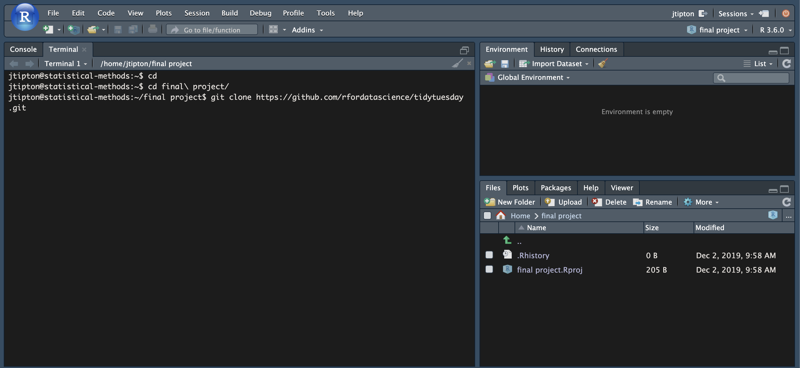

```{r setup, include=FALSE}
knitr::opts_chunk$set(echo = TRUE)
```

# Create a project on the server {#project}

First, create a project on the server.

# Download Tidy Tuesday data

## Get the Tidy Tuesday repository link {#link}

Go to the [Tidy Tuesday GitHub site](https://github.com/rfordatascience/tidytuesday) and click on the green \textcolor{green}{clone or download} button.


Next, select the copy button to copy the url link. [https://github.com/rfordatascience/tidytuesday.git](https://github.com/rfordatascience/tidytuesday.git)


## Download the data into your project

In your [project](#project) created in step 1, select the **terminal window**. 


If there is no terminal window, you can access the terminal using Tools -> Terminal -> New Terminal


## Locate your project folder in the terminal

First, you need to navigate to your home directory. To do this, type 

```{bash, eval = FALSE}
cd
```

and then hit the return/enter key. 


Next, you need to navigate to your project folder. My project is named `final-project`. To change to this folder, type

```{bash, eval = FALSE}
cd final-project/
```

and hit the return/enter key. 

## Make sure there is a directory named `data` in your directory

After you have navigated to your project directory using the terminal, make a `data` directory using 

```{bash, eval = FALSE}
mkdir data
```

and then navigate to the data using 

```{bash, eval = FALSE}
cd data
```


## Download the Tidy Tuesday data into your project folder

Once you are in the `data` folder in your project folder (`final-project/data` for this example), download all of the Tidy Tuesday data by typing the copied repository clone ([green button from tidy Tuesday gitHub pageproject](#link))

```{bash, eval = FALSE}
git clone https://github.com/rfordatascience/tidytuesday.git
```




Once the data has been downloaded, the terminal should look like this: 


Notice that the folder tidytuesday is now in the project file directory.

# Loading data from Tidy Tuesday

To load data from the Tidy Tuesday folder, we use the `here` library. 

```{r, include = FALSE, echo = TRUE}
library(tidyverse)
library(here)
```


## Example: `.csv` file - NZ bird data

Say I am interested in the November 19, 2019 dataset on New Zealand bird voting. The data are in a `.csv` file named `nz_bird.csv` that can be loaded using the `read_csv()` function from the folder path (relative to the project folder) `data/tidytuesday/data/2019/2019-11-19/`. By the way, widespread voter fraud was just discovered in the [2020 New Zealand bird of the year voting](https://www.npr.org/2020/11/14/934749679/for-the-birds-voter-fraud-ruffles-new-zealand-bird-of-the-year-competition).

```{r}
dat <- read_csv(here::here("data", "tidytuesday", "data", "2019", "2019-11-19", "nz_bird.csv"))
glimpse(dat)
```


<!-- ## Example `.xls` file - Student Loan Repayments -->

<!-- Say I am interested in the November 25, 2019 dataset on student loan repayment. The data are in `.xls` files. We will load the file `PCA_Report_FY16Q1.xls` that can be loaded using the `read_xl()` function from the `readxl` package -->

<!-- ```{r} -->
<!-- # install.packages("readxl") -->
<!-- library(readxl) -->
<!-- dat <- read_xls(here("tidytuesday", "data", "2019", "2019-11-26", "PCA_Report_FY16Q1.xls")) -->
<!-- glimpse(dat) -->
<!-- ``` -->


